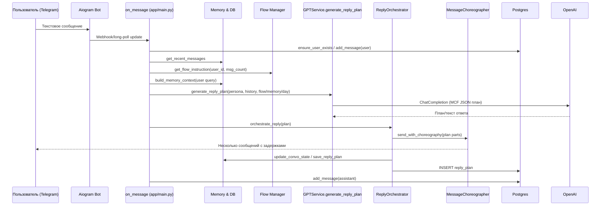

# Процесс генерации ответа на сообщение пользователя

Документ описывает текущий pipeline ответа на входящее сообщение в Telegram-боте, включая последовательность вызовов, используемые подсистемы и полный стек промптов, передаваемых в GPT при генерации плана ответа.

## Краткая схема процесса



## Подробный шаг‑за‑шагом

1. **Приём сообщения и подготовка контекста** (`on_message` в `app/main.py`):
   - Проверяет выбранную персону, язык и активные действия (селфи/видео). Если всё ок, сохраняет пользовательское сообщение в БД через `add_message` и извлекает историю `get_recent_messages` для формирования `messages` для GPT.【F:app/main.py†L1804-L1870】
   - Запускает периодическое извлечение фактов (`fact_extractor.process_conversation_batch`) при первом сообщении и далее каждые 5 пользовательских сообщений, чтобы обогащать память.【F:app/main.py†L1871-L1926】
   - Получает количество сообщений пользователя для правил онбординга и баланса вопросов перед вызовом GPT.【F:app/main.py†L1933-L1964】

2. **Сбор расширенного контекста** (`ReplyOrchestrator.build_enriched_context`):
   - Извлекает последний пользовательский текст для семантического поиска.
   - Вызывает `memory_manager.build_memory_context` с семантическим поиском фактов, кратким summary и открытыми петлями.
   - Добавляет `day_story` и `current_activity` из симулятора дня для естественного самораскрытия персоны.
   - Возвращает словарь `{memory_context, day_story, current_activity}` для промпта GPT.【F:app/reply_orchestrator.py†L21-L94】

3. **Динамическое управление темами и вопросами** (`ConversationFlowManager.get_flow_instruction`):
   - Анализирует последние сообщения ассистента в БД, определяет недавние категории тем и количество вопросов.
   - Для первых 15 сообщений включает строгий онбординг: запрет вопросов и слова «понимаю», требование делиться личными историями с деталями и ограничением длины.
   - В обычном режиме и при избытке вопросов вставляет аварийные инструкции избегать вопросов и переключать тему, а также даёт целевое распределение длины сообщений.【F:app/conversation_flow_manager.py†L23-L245】

4. **Сборка системного промпта и вызов GPT** (`GPTService.generate_reply_plan`):
   - Берёт персональный системный промпт из кэша/БД и добавляет **CRITICAL RULE** «не интервьюер» и компактные паттерны ответов.【F:app/services_gpt.py†L62-L148】
   - Добавляет универсальную инструкцию отвечать на языке пользователя, динамическую вставку из Flow Manager (включая анти‑вопрос блок), память (`memory_context`), контекст дня (`day_story`, `current_activity`) и текстовый режим без описаний действий.【F:app/services_gpt.py†L260-L419】
   - Прикрепляет инструкцию Message Choreography Format (MCF) с JSON-шаблоном частей, ограничениями на долю вопросов, длину и задержки между частями.【F:app/services_gpt.py†L644-L717】
   - Делает вызов `OpenAI.chat.completions` (модель `gpt-4o-mini`) и пытается распарсить ответ как JSON-план; в противном случае использует текст как одно сообщение и очищает от звёздочек/действий.【F:app/services_gpt.py†L421-L517】

5. **Оркестрация отправки** (`ReplyOrchestrator.orchestrate_reply`):
   - При необходимости парсит план, смягчает повторяющиеся вопросы через `IntentManager` (замена на утверждения).
   - Передаёт нормализованный план в `MessageChoreographer.send_with_choreography`, который отправляет 2–4 части с типинг-делеями и форматами «text»/«ps» и др.
   - После отправки обновляет состояние беседы (счётчик поворотов темы, возможный автосвитч), сохраняет план и агрегированное текстовое представление в БД для аналитики.
   - При сбое может отправить текст напрямую без хореографии.【F:app/reply_orchestrator.py†L105-L226】

6. **Сохранение и дополнительная логика**:
   - Основной хендлер фиксирует фактический текст ответа в БД, логирует стоимость GPT через `cost_tracker`, и запускает подсказчик подарков при необходимости (вне области промптов).【F:app/main.py†L1970-L2049】

## Стек промптов, передаваемых в GPT при генерации плана

Ниже перечислены блоки, которые конкатенируются в `system_content` перед вызовом `chat.completions`:

1. **Persona System Prompt** – персональное описание из БД или оптимизированного фолбэка с добавленным критическим правилом «You are NOT an interviewer… 70% без вопросов» и супер‑компактными паттернами ответов.【F:app/services_gpt.py†L62-L148】
2. **Language Instruction** – напоминание отвечать на том же языке, что пользователь («Always reply in the SAME LANGUAGE…»).【F:app/services_gpt.py†L295-L298】
3. **Flow Instruction** – динамический блок из `ConversationFlowManager`, включающий онбординг/анти‑вопрос/переключение тем/длины сообщений.【F:app/services_gpt.py†L299-L334】【F:app/conversation_flow_manager.py†L23-L245】
4. **Anti‑question rule (дополнение)** – усиленный блок про 70% ответов без вопроса с примерами корректных/некорректных фраз.【F:app/services_gpt.py†L308-L334】
5. **Memory Context** – вставка фактов, саммари и open loops из `memory_manager.build_memory_context` (если доступны).【F:app/services_gpt.py†L336-L339】
6. **Day Context** – текущая активность и истории дня с инструкциями про натуральное встраивание истории и избегание «кстати/бу арада».【F:app/services_gpt.py†L340-L371】
7. **Text Output Reminder** – запрет описаний действий и звёздочек для текстовых ответов (для голосового режима добавляется отдельный блок).【F:app/services_gpt.py†L378-L412】
8. **Emoji Guidance** – персональные правила по частоте/стилю эмодзи на основе настроек персоны.【F:app/services_gpt.py†L718-L738】
9. **Time Context** – подсказка учитывать текущее время суток при ответе.【F:app/services_gpt.py†L740-L760】
10. **Message Choreography Format (MCF)** – инструкция вернуть JSON с частями, задержками, долей вопросов и примерами плавных переключений тем.【F:app/services_gpt.py†L644-L717】

## Архитектура компонентов

```mermaid
flowchart TD
    A[User message<br/>(Telegram)] --> B[aiogram on_message]
    B --> C[DB/Postgres<br/>messages, persona, settings]
    B --> D[Memory Manager<br/>build_memory_context]
    B --> E[ConversationFlowManager<br/>topic/question control]
    D --> G[GPTService.generate_reply_plan]
    E --> G
    B --> F[Day Simulator<br/>day_story/current_activity]
    F --> G
    G --> H[OpenAI GPT-4o-mini]
    H --> G
    G --> I[ReplyOrchestrator]
    I --> J[MessageChoreographer<br/>send_with_choreography]
    J --> K[Telegram user replies]
    I --> C
```

